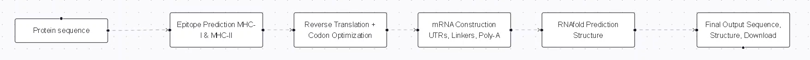
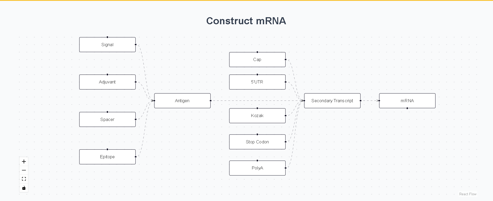
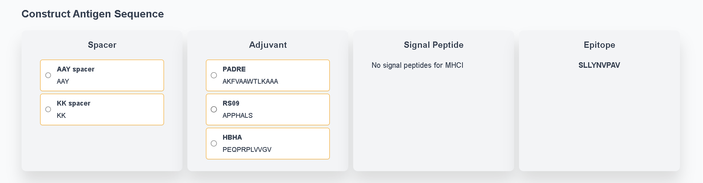

# 🧬 Prot2Vac: mRNA Vaccine Design from Human Protein Sequences

## Introduction

Prot2Vac is a web-based platform builds on this innovation by offering
          a fully automated pipeline for mRNA vaccine design. Starting with a
          simple protein, the tools predicts epitopes using a widely used
          database, IEDB. Next, the tool performs reverse translation,
          species-specific codon optimization, and modular antigen construction.
          It then appends key mRNA regulatory elements such as the 5′ cap, Kozak
          sequence, untranslated regions (UTRs), and a poly(A) tail. To ensure
          structural integrity and stability, the platform runs RNAfold to
          predict secondary structure, compute the minimum free energy (MFE),
          and generate a visual representation of the mRNA molecule. 
          
          
Users can
          analyze GC content, view the full construct, and download both the
          final sequence and a detailed report. This application simplifies
          complex bioinformatics processes into an intuitive workflow, making it
          an essential resource for researchers, educators, and developers
          involved in vaccine design and synthetic biology.

## Key Features

- ✅ Predicts **MHC-I** and **MHC-II** epitopes using **pretrained IEDB deep learning models**  
- ✅ Supports **allele-specific** predictions (e.g., `HLA-A*02:01`, `HLA-DRB1*07:01`)  
- ✅ Ranks predicted epitopes by **IC50** and **percentile** values  
- ✅ Offers customization with **signal peptides**, **spacers**, and **adjuvants**  
- ✅ Appends essential **mRNA elements**: 5′ cap, 5′ UTR, Kozak sequence, 3′ UTR, poly(A) tail  
- ✅ Performs **reverse translation & codon optimization** using Kazusa tables  
- ✅ Predicts **mRNA secondary structure** and **MFE** via RNAfold  
- ✅ Outputs **full sequence summary**, dot-bracket notation, and structural visualization  

## Pipeline Overview

## 🖼️ Visuals 

## Technologies Used

- Python
- IEDB Tools API — MHC epitope prediction
- Kazusa Codon Usage — Reverse translation & optimization
- ViennaRNA RNAfold — RNA secondary structure prediction
- Flask for backend API and React frontend

## 📥 Input Requirements

- ✅ A protein sequence (FASTA or plain string)
- ✅ User-selected:
  - MHC Class I allele (e.g., HLA-A*02:01)
  - MHC Class II allele (e.g., HLA-DRB1*07:01)
- ✅ Optional:
  - Signal peptide (e.g., tissue-specific)
  - Adjuvants (e.g., defensins)
  - Spacers (e.g., GPGPG)

## 📤 Output

- ✅ Codon-optimized mRNA vaccine sequence
- ✅ RNA secondary structure in dot-bracket notation
- ✅ Minimum Free Energy (MFE) of the folded RNA
- ✅ Output summary:
  - Selected epitopes and MHC alleles
  - Regulatory and immunological components used
  - Full final sequence with annotations

> **Final mRNA Vaccine Construct**  
> m7G GGGAAAUUUCUUAUUGCAGCCGCCAC GCCACCAUGG [Signal] [Adjuvant] [Spacer] [Epitope] ... UAA UUAUUUUAUUAAGCUAUAAA [Poly(A)]  
> 
> MFE: -33.45 kcal/mol  
> Dot-Bracket: (((..((....))...)))...

## 🔭 Future Work

- Support multiple epitopes across alleles
- Add B-cell epitope prediction (linear & conformational)
- Add antigenicity, allergenicity, and toxicity prediction
- Allow codon optimization for other host organisms (e.g., E. coli, mouse)

## 📄 License

This project is licensed under the MIT License — see the LICENSE file for details.

## 🙌 Acknowledgments

- IEDB Analysis Resource – http://tools.iedb.org/
- ViennaRNA Package – https://www.tbi.univie.ac.at/RNA/
- Kazusa Codon Usage Database – https://www.kazusa.or.jp/codon/
